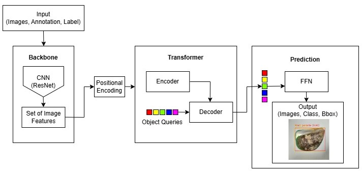
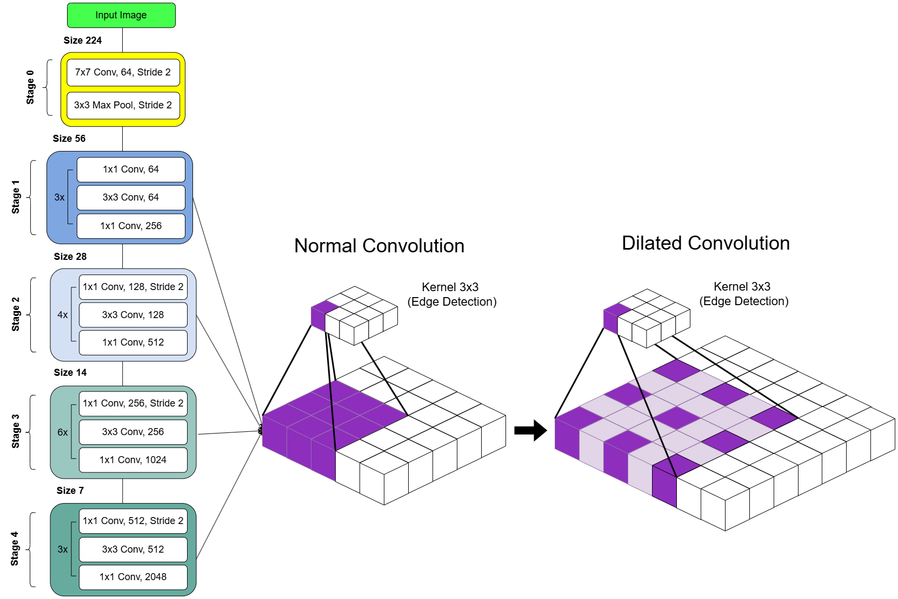

# Automatic Parasite Detection on Bivalve Shells Using Detection Transformer

A deep learning-based system for detecting parasitic worms on bivalve shells using the Detection Transformer (DETR) with ResNet backbones.

---

## 📊 Dataset
- Total: **521 images**
  - 381 images (secondary data from Google Images)
  - 140 images (primary data collected in TPI Bondet, Cirebon, Indonesia)
- Classes:
  - Parasite
  - Non-parasite
- Image size: **224 × 224**

---

## Model
Download DETR model from HuggingFace (or other resources):  
https://huggingface.co/docs/transformers/model_doc/detr

```python
from transformers import DetrForObjectDetection
model = DetrForObjectDetection.from_pretrained("facebook/detr-resnet-50")
```

you can also clone this repository: 
- if you have annotated data, you can directly use without roboflow API key
- if you have raw data, you should annotate it first using roboflow (https://app.roboflow.com/) or another platform
- if use this code, you should adjust the image size to 224x224

# HOW TO USE THIS REPOSITORY: 
1. Run config.py (provide your API key from Roboflow)
2. Adjust your model configuration
3. Run train.py, then modify your workspace name and project name
4. Run testing.py
5. Results will be saved in the evaluation_result folder

---
## Detection Pipeline

1. Input annotated images
2. Feature extraction using CNN backbone (ResNet)
3. Feature flattening + positional encoding
4. Transformer encoder-decoder processing
5. Object queries predict bounding boxes
6. Feed Forward Network (FFN) produces:
   - Bounding box coordinates
   - Class labels (parasite / non-parasite)
   - Confidence scores
    
In addition to standard DETR, this study explores dilated convolution applied to ResNet backbones:


| Model            | Backbone   | Dilated Stage   | Dilation Values | Epoch |
|------------------|------------|-----------------|-----------------|-------|
| DETR             | ResNet-50  | Stage 1,2,3,4   | 2,2,4,8         | 100   |
| DETR             | ResNet-101 | Stage 1,2,3,4   | 2,2,4,8         | 100   |
| DETR             | ResNet-50  | Stage 3,4       | 2,2             | 100   |
| DETR             | ResNet-101 | Stage 3,4       | 2,2             | 100   |
| DETR             | ResNet-50  | Stage 4         | 2               | 100   |
| DETR             | ResNet-101 | Stage 4         | 2               | 100   |
 
 ---
## 📈 Results
| Model      | Dilation | AP@50 | AP@75 | mAP  | APₛ  | APₘ  | APₗ  | AR   |
|------------|----------|------:|------:|------:|------:|------:|------:|------:|
| DETR-R50   | -        | 0.630 | 0.578 | 0.550 | 0.227 | 0.420 | 0.607 | 0.573 |
| DETR-R101  | -        | 0.610 | 0.520 | 0.530 | 0.428 | 0.391 | 0.573 | 0.551 |
| DETR-R50   | 2,2,4,8  | 0.636 | 0.572 | 0.551 | 0.232 | 0.452 | 0.534 | 0.557 |
| DETR-R101  | 2,2,4,8  | 0.607 | 0.532 | 0.528 | 0.369 | 0.359 | 0.567 | 0.538 |
| DETR-R50   | 2,2      | 0.663 | 0.592 | 0.573 | 0.401 | 0.431 | 0.620 | 0.587 |
| DETR-R101  | 2,2      | 0.636 | 0.547 | 0.547 | 0.238 | 0.402 | 0.596 | 0.552 |
| DETR-R50   | 2        | **0.677** | **0.597** | **0.586** | **0.437** | **0.454** | 0.610 | **0.605** |
| DETR-R101  | 2        | 0.666 | 0.590 | 0.580 | 0.430 | 0.438 | **0.626** | 0.594 |

ResNet-50 consistently outperformed ResNet-101 across all configurations, both under default settings and with dilated convolution. The best performance was achieved using dilation at stage 4 (rate = 2), resulting in an mAP of 0.586 and AR of 0.605.
